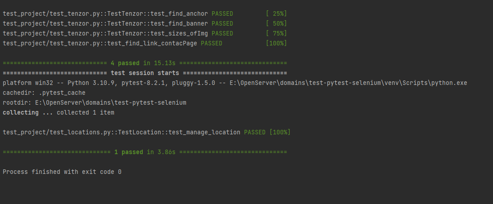

# Задание
1) Необходимо автоматизировать проверки двух сценариев.
1) Автотесты реализованы на Python 3 и Selenium Webdriver
1) В качестве тестового framework используется pytest
1) Реализован паттерн PageObject
1) Приветствуются любые сторонние библиотеки для логирования, отчетов, selenium wrapper
1) Готовый проект залит на github/gitlab без кешей, драйверов и виртуальных окружений. С открытым доступом на чтение.

## Первый сценарий:
1) Перейти на https://sbis.ru/ в раздел "Контакты"
2) Найти баннер Тензор, кликнуть по нему
3) Проверить, что есть блок "Сила в людях"
4) Перейдите в этом блоке в "Подробнее" и убедитесь, что открывается https://tensor.ru/about
6) Находим раздел Работаем и проверяем, что у всех фотографии хронологии одинаковые высота (height) и ширина (width)

## Второй сценарий:
1) Перейти на https://sbis.ru/ в раздел "Контакты"
2) Проверить, что определился ваш регион (в нашем примере Ярославская обл.) и есть список партнеров.
3) Изменить регион на Камчатский край
4) Проверить, что подставился выбранный регион, список партнеров изменился, url и title содержат информацию выбранного региона

## Note:
`main.py` является стартовым файлом

